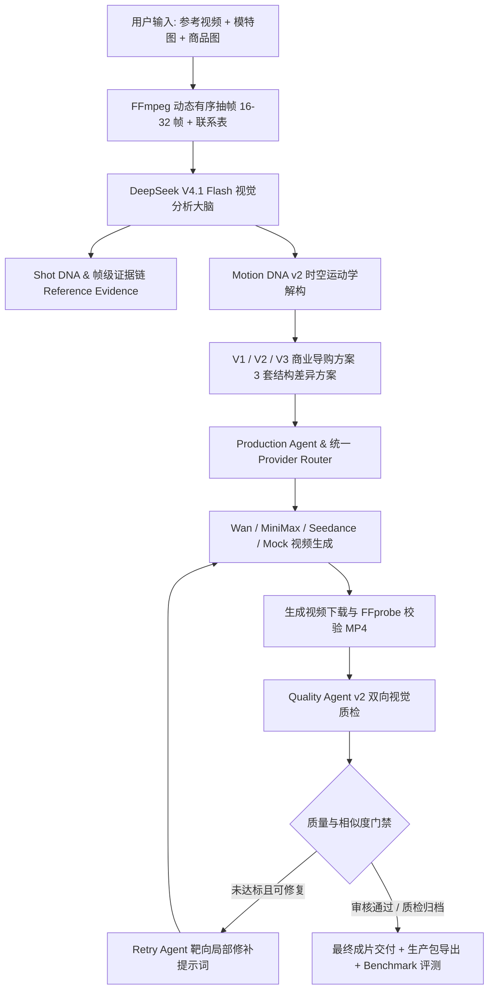

# AI Video Director v1.3 · Real Benchmark & Production Validation

AI Video Director 保留 Director-first 生产链路，并把离线 Synthetic Benchmark 与真实成片 Real Benchmark 严格分开。Synthetic 只验证评分和报告代码；Real 才能验证视频效果优势。

运行 `npm run benchmark:synthetic` 可在无凭证环境验证离线框架；运行 `npm run benchmark:real` 需要 DeepSeek、Wan 或 MiniMax 凭证和授权素材。缺少条件时只会输出 `REAL_BENCHMARK = UNAVAILABLE`，不会伪造分数或静默降级。

---

## 核心架构 (Architecture Diagram)



---

## 核心能力升级

### 1. Motion Intelligence (Motion DNA v2)
- **拒绝模糊形容词**：全面禁止“自然走路”、“高级展示”、“优雅动作”等无指导力词汇。
- **生理动力学解构**：强制规范视线先行（Gaze-leading）、颈部延迟偏转、肩躯反相摆动、步态重心转移（Weight-transfer）、非对称摆臂、手持物体持续物理接触与收尾布料沉降（Settling）。
- **帧级证据链 (Motion Evidence)**：所有动作特征必须绑定抽样帧 ID 列表与置信度；无法观测项严格标为 `UNKNOWN`，杜绝模型幻觉。

### 2. Visual Quality Intelligence (Quality Agent v2)
- **四维 100 分制质检模型**：
  - `motion_naturalness` (0–25 分)：步态连贯性、肢体惯性阻尼。
  - `human_realism` (0–25 分)：视线自然度、微表情放松、头颈分步转动。
  - `product_consistency` (0–25 分)：商品外廓与纹理保真、手指无穿模贴合。
  - `commercial_quality` (0–25 分)：摄影机运镜平滑度、商业构图与光影质感。
- **参考视频相似度评分 (Reference Similarity Score)**：
  - 质检时同时输入参考视频关键抽帧与生成成片帧。
  - 评估 `camera_similarity`、`motion_similarity`、`composition_similarity`、`product_presentation_similarity`，输出 0–100 综合相似度评分。
- **靶向局部修补 (Targeted Retry Agent)**：
  - 不重写全局 Prompt，针对机械手臂、生硬转身、商品形变等具体缺陷进行局部提示词约束注入。

### 3. 统一 Benchmark 评测系统
- **5 大商业品类用例库** (`benchmark/cases/`)：
  1. 女装服饰 (`01_womenswear.json`)
  2. 美妆护肤 (`02_beauty.json`)
  3. 食品饮料 (`03_food.json`)
  4. 消费数码 (`04_digital.json`)
  5. 生活家居 (`05_lifestyle.json`)
- **加权评分公式 (AI Video Director Score)**：
  $$\text{Score} = \text{Motion}(30\%) + \text{Human}(25\%) + \text{Product}(25\%) + \text{Camera}(20\%)$$
- **对比模式 (Baseline vs Director)**：
  - 一键运行对比普通直接提示词生成与 Director 方案的指标差距，自动产出 `benchmark/reports/comparison-report.md`。

---

## 运行模式

- `APP_MODE=director`：仅调用 DeepSeek 分析视频并输出 3 套商业导演方案，无视频生成费用。
- `APP_MODE=mock`：离线流程演示，成片显著标注 `DEMO ONLY`。
- `APP_MODE=full`：完整生产流水线（DeepSeek Director → Production Agent → Provider 生成 → Quality Agent v2 视觉质检）。

```powershell
# 安装依赖
npm install

# 启动本地服务 (默认端口 3080)
npm run dev -- --port 3080
```

---

## 自动化测试与验证

```powershell
# 运行全部单元与集成测试 (71+ 项测试)
npm test

# 运行 TypeScript 类型检查
npm run typecheck

# 运行代码规范检查
npm run lint

# 生产环境打包构建
npm run build

# 运行视觉质量专项测试
npm run quality-test

# 运行 Synthetic Benchmark（离线；不是真实视频证据）
npm run benchmark:synthetic

# 运行 Real Benchmark（需要凭证和授权素材；缺少条件时 UNAVAILABLE）
npm run benchmark:real

# 客户展示前预检（任何 P0 FAIL 都禁止现场生产）
npm run demo:preflight

# Golden Case 单 V1 真实彩排；无有效配置时明确 UNAVAILABLE
npm run demo:live

# 只读回放已验证的真实历史任务，不调用任何模型或视频 Provider
npm run demo:replay -- <completed-real-task-id>
```

---

## 商业使用流程 (Commercial Workflow)

1. **上传素材**：
   - 选取一段真人商业爆款视频作为镜头参考（1–120 秒，MP4/MOV）。
   - 上传模特穿搭照（外观/多角度）与商品特写照（外观/细节）。
2. **输入创作诉求**：
   - 输入具体营销诉求（支持一键添加“自然导购感”、“突出产品细节”、“避免机械复刻”）。
3. **生成设置与勾选**：
   - 支持多选 V1（轻奢时尚）、V2（都市通勤）、V3（活力街拍）。
   - 可选上传成片首帧图；未上传时系统自动截取参考视频首帧并补边为 9:16。
4. **AI 导演执行**：
   - 自动化时空连续抽帧 → DeepSeek 视觉解构 Motion DNA v2 与 Shot DNA → 编译生成 3 套差异化可执行导演方案。
5. **智能生产与双向审核**：
   - 调度视频生成模型（Wan / MiniMax / Seedance）完成渲染并拉取本地 MP4。
   - Quality Agent 双向比对参考视频与成片，审核通过出具推荐标记；未达标执行靶向修补重试。
6. **交付与资产导出**：
   - 页面直接预览与下载成片；一键导出创作包（含提示词、导演方案、Motion DNA、证据链与资产清单）。

---

## 安全与隐私规范

- 所有 `API Key`（DeepSeek, Wan/DashScope, MiniMax, Seedance）与本地私有配置均存放在 `.env.local`，已被 `.gitignore` 严格排除。
- 用户原始视频、中间抽帧、生成视频及本地工程数据均存放在 `data/` 目录，禁止且不会提交至 GitHub。

## 客户展示边界

- `demo:preflight` 只做本机和 DNS/HTTPS 安全检查，不创建付费视频任务。
- `demo:live` 固定 Golden Case 的 V1、Wan 单 Provider 和最多一次质量重试；提交意图与远程 task ID 持久化后才允许恢复。
- `demo:replay` 只显示 `Verified Previous Run / 已验证历史任务`。没有通过真实 MP4/QC 门禁的任务不会伪装成历史成片。
- Synthetic Benchmark 的分数只验证代码和报告渲染；Real Benchmark 没有真实成片时显示 `NOT YET VERIFIED` / `UNAVAILABLE`。
